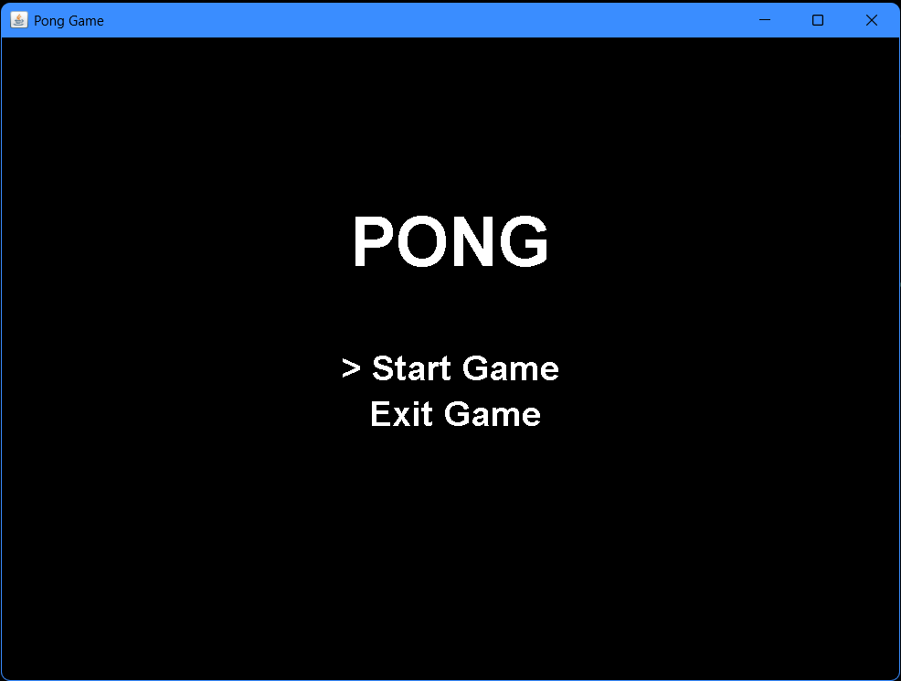
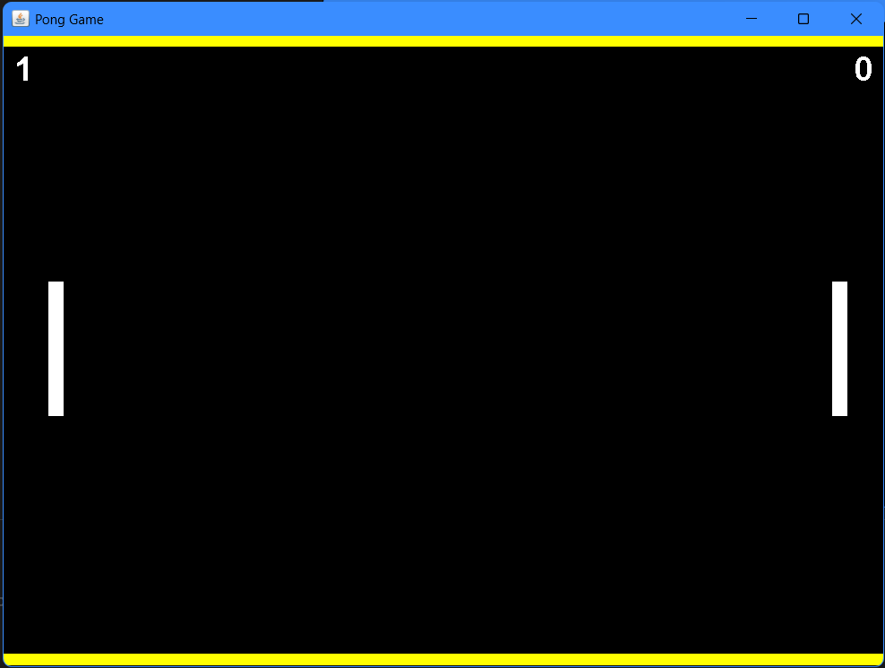
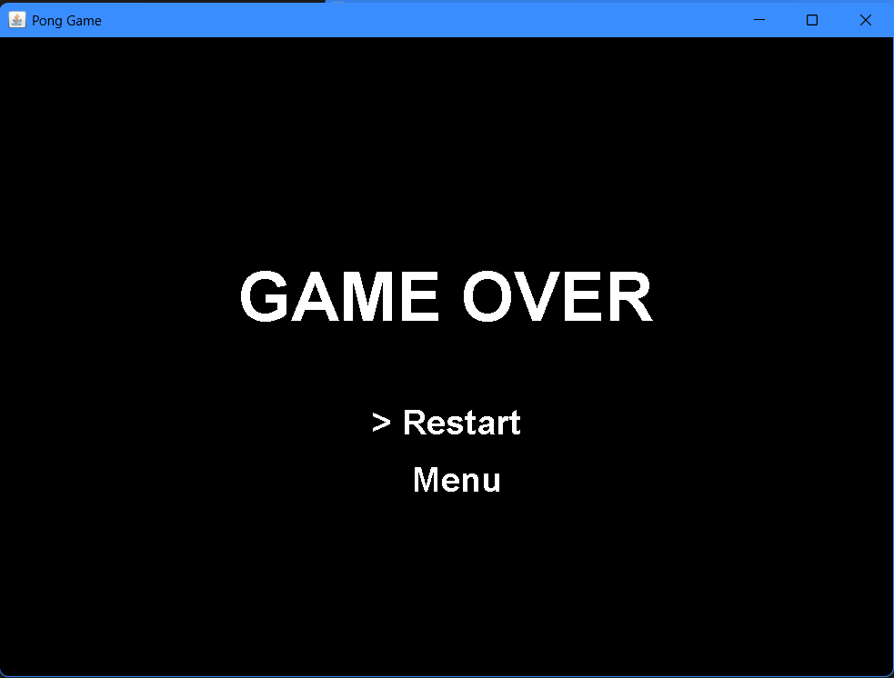

# Pong Game (Java)

A classic **two-player Pong game** built from scratch using **Java Swing**.
This project recreates the original arcade gameplay with smooth physics, sound effects, scoring system, and a complete menu interface.

The game was developed as a learning project to understand **game loops, collision physics, rendering, and input handling in Java**.

---

## 🎮 Features

- Two-player gameplay
- Smooth 60 FPS game loop
- Real-time paddle control
- Ball physics influenced by paddle motion
- Sound effects for gameplay events
- Scoring system
- Game Over screen with restart/menu options
- Flickering ball respawn animation
- Interactive main menu
- Packaged executable for easy launch

---

## 🕹 Controls

### Player 1 (Left Paddle)

W → Move Up
S → Move Down

### Player 2 (Right Paddle)

↑ → Move Up
↓ → Move Down

### Game Controls

Enter → Select menu option
Esc → Return to menu during gameplay

---

## 🧠 Gameplay Mechanics

- The ball bounces off paddles and walls.
- Paddle movement influences the **bounce angle** of the ball.
- First player to reach **10 points wins the game**.
- After each goal, the ball respawns in the center with a **random direction** and flicker animation.

---

## 🔊 Sound Effects

The game includes audio feedback for:

- Game start
- Menu navigation
- Paddle hits
- Goals scored
- Ball respawn

All audio files are stored as `.wav`.

---

## 📸 Screenshots

### Main Menu



### Gameplay



### Game Over



---

## 📁 Project Structure

```
PongGame/
│
├── src/
│   ├── PongGame.java
│   ├── GamePanel.java
│   ├── Ball.java
│   ├── Paddle.java
│   └── SoundManager.java
│
├── sounds/
│   ├── opening.wav
│   ├── paddle.wav
│   ├── goal.wav
│   └── respawn.wav
│
├── screenshots/
│
├── PongGame.jar
├── PongGame.exe
└── README.md
```

---

## ▶ Running the Game

### Option 1 – Run the Executable

Simply double-click:

```
PongGame.exe
```

### Option 2 – Run the JAR

```
java -jar PongGame.jar
```

---

## ⚙ Requirements

- Windows OS
- Java Runtime Environment (if running the JAR)

If the runtime is bundled with the game, no installation is required.

---

## 🛠 Built With

- Java
- Java Swing
- IntelliJ IDEA

---

## 📚 What I Learned

While building this project I learned about:

- Game loop design
- Collision detection
- Object-oriented game architecture
- Handling keyboard input
- Sound integration in Java
- Packaging Java applications for distribution

---

## 📄 License

This project is open-source and free to use for learning purposes.

---

## 👤 Author

Created by **[Your Name]**
